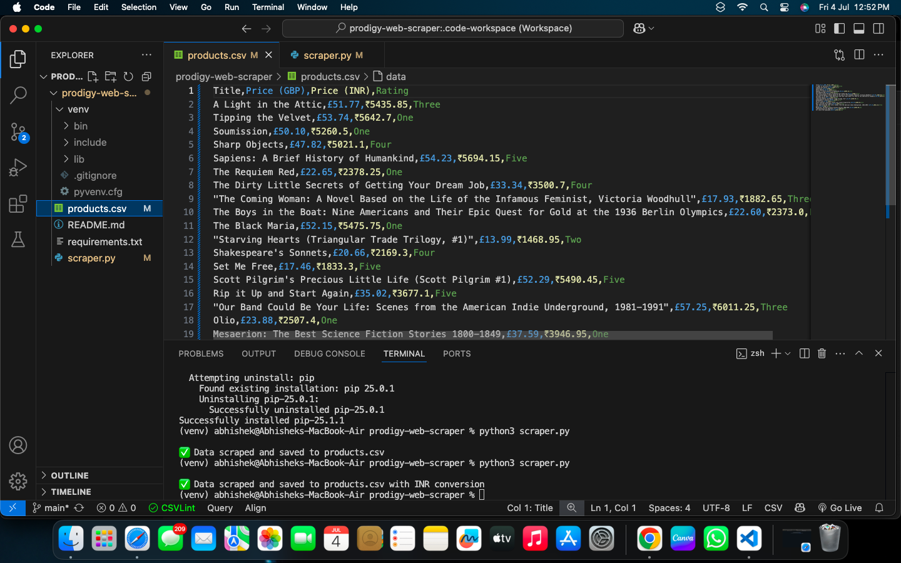

# 🕷️ Prodigy Web Scraper

This project was developed as part of the **Software Development Internship** at [Prodigy InfoTech](https://prodigyinfotech.dev/). The objective was to create a Python-based web scraping tool that extracts product details from an e-commerce website and stores them in a structured CSV format.

---

## 📌 Task Overview

**Task Title:** Web Scraping  
**Internship:** Software Development – Prodigy InfoTech  
**Duration:** July 2025  
**Objective:** Scrape product titles, prices, and ratings from an e-commerce platform and export the data to a CSV file.

---

## 🛠️ Tech Stack Used

- `Python 3`
- `Requests`
- `BeautifulSoup (bs4)`
- `Pandas`
- `lxml`

---

## 🌐 Target Website

The data was extracted from [Books to Scrape](https://books.toscrape.com/), a public e-commerce demo site ideal for scraping projects.

---

## 📊 Features

- Extracts:
  - Book Title
  - Price (in GBP)
  - Star Rating
- Converts Price from GBP to INR (₹) using a fixed conversion rate (1 GBP = ₹105)
- Saves data to a structured CSV file
- Clean and minimal codebase

---

## 📁 File Structure

### 🖼️ Sample Output

| Title                 | Price (GBP) | Price (INR) | Rating |
|-----------------------|--------------|-------------|--------|
| A Light in the Attic  | £51.77       | ₹5435.85    | Three  |
| Tipping the Velvet    | £53.74       | ₹5642.70    | One    |

